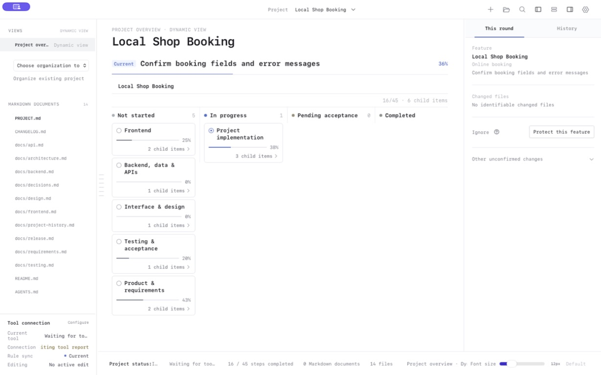
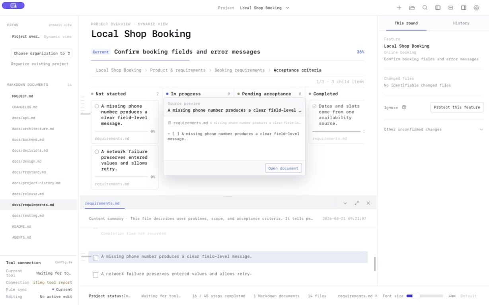
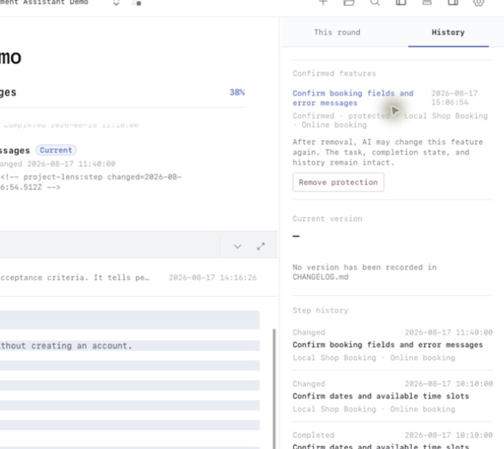
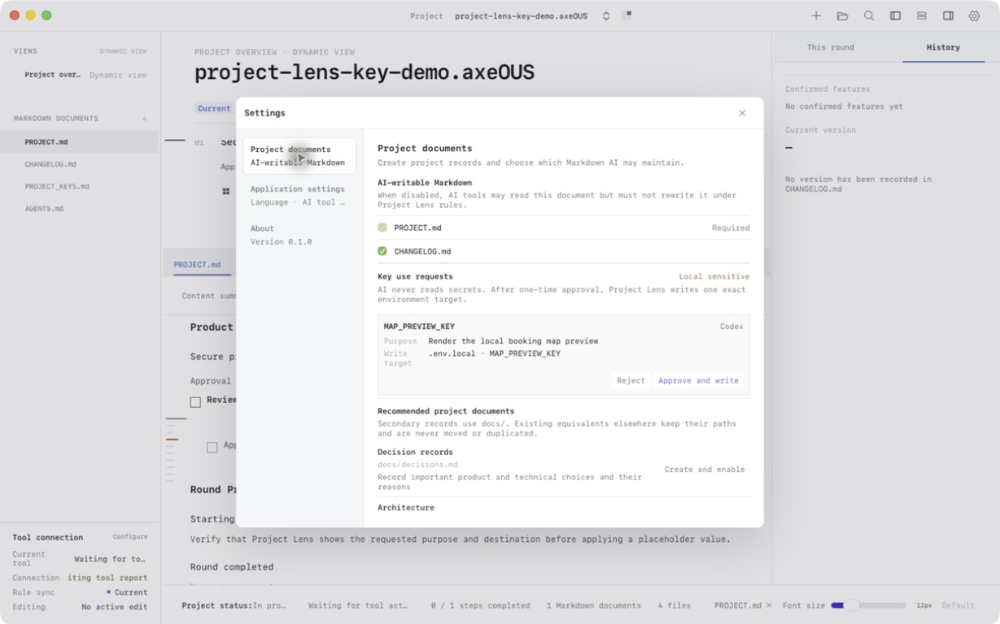
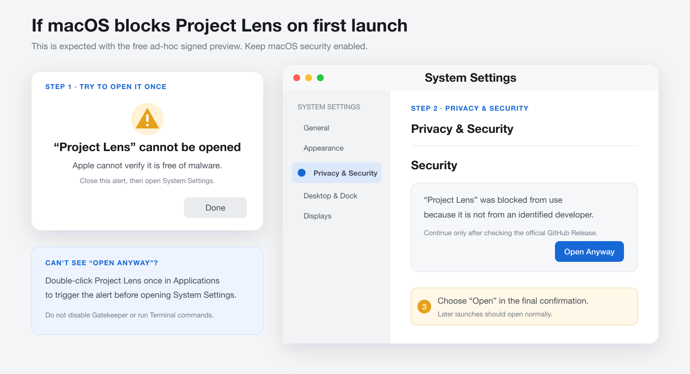

<p align="right">
  <a href="./README.md">简体中文</a> · <strong>English</strong>
</p>

# Project Lens

### Keep track of what an AI-edited project is doing, why it is changing, and where it should go next.

Project Lens is a local-first macOS workspace built especially for vibe coding. It reads the real Markdown files in a project and turns product features, phases, tasks, documentation, and AI-tool activity into a live overview. Even when AI performs most of the implementation and you do not know every line of code, you can still see the direction, recent changes, and the document that explains the next step.

## Problems it solves

- **AI changes code faster than people can review it.** Direction, current work, and rationale disappear inside long conversations, making the next session hard to resume.
- **A project has many documents, but no obvious next place to read.** Project Lens connects requirements, design, technical, test, and release Markdown through one overview and opens the exact source from a task.
- **Later AI edits can damage an accepted feature.** Confirmed features and designs become protected baselines; another change must disclose its scope, affected files, and risks first.
- **A code diff does not explain which product behavior changed.** The current round, persistent history, and `CHANGELOG.md` separately show active work, accepted work, and user-facing release changes.
- **Project-secret use is hard to audit.** AI tools request only a key name, purpose, and exact destination; Project Lens writes the value into the current project only after user approval.

## Who it is for

- Vibe coders turning ideas into products while keeping their attention on direction, features, and outcomes.
- Developers who use AI coding tools but do not want project direction to disappear inside a long chat.
- Product owners and independent makers who need to judge whether a feature is actually complete without reading every line of code.
- People who use multiple AI tools and want them to maintain one shared set of project facts and documents.
- Teams that prefer local Markdown, Git, and real files over project state locked inside a cloud service.



## Five core capabilities

### 1. Jump from the overview to the exact source document

The overview stays focused on product features, project phases, and primary tasks. Click a task and Project Lens opens its linked Markdown document at the relevant heading or the next unfinished checklist item.

```text
“Confirm booking fields and error messages” in the overview
        ↓ click
Open docs/requirements.md
        ↓
Locate “Booking form” and its acceptance criteria
```



People see the direction first and open details only when needed. AI tools can follow the same links to the document they are expected to maintain.

### 2. Understand the current round and version history

Project Lens associates changed files with product work and shows the current round, persistent history, and user confirmation state. Git remains the source of real commits, while `CHANGELOG.md` explains what each release changed for users.

| What you see | What it answers |
| --- | --- |
| Current round | Which feature did the AI work on, and which files changed? |
| History | Which features were confirmed, and what changed previously? |
| Release record | What was added, fixed, or adjusted in each release? |
| Feature protection | Was the risk approved before changing a confirmed feature? |

### 3. Create project documents that keep AI tools aligned

Create only the project documents you need from Settings. Each generated document begins with a clear purpose note for both people and AI tools.

| Document | Purpose |
| --- | --- |
| `PROJECT.md` | The source of project direction, phases, tasks, and the current step |
| `CHANGELOG.md` | User-facing additions and changes for each release |
| `docs/decisions.md` | Important product and technical decisions with their rationale |
| `docs/testing.md` | Test scope, validation results, and remaining risks |
| `docs/frontend.md` / `backend.md` | Frontend and backend structure, constraints, and implementation checklists |
| `docs/api.md` / `data.md` | API contracts, data fields, and migration conventions |
| `docs/architecture.md` | System boundaries, dependencies, and the technical direction |

Project Lens manages the shared rules in `AGENTS.md`. Codex, Claude Code, Cursor, VS Code/Copilot, Windsurf, JetBrains, Zed, and other tools can follow the same project facts. Tool-specific rule files remain thin entry points and do not duplicate task state.

### 4. Protect confirmed features and designs

After a feature, interaction, or design is confirmed by the user, Project Lens keeps it in history as a protected baseline. An AI tool cannot quietly overwrite it later. The tool must first explain the proposed change, affected files, and risks to existing behavior, then wait for the user to approve that specific request.



```text
Confirm a feature or design
        ↓
Keep it as a protected historical baseline
        ↓ AI proposes another change
Show scope, affected files, and risks
        ↓ user approves this request
Allow only that explicit change
```

This is not a permanent file lock. Necessary changes remain possible, while accidental regressions to accepted work become visible. One approval does not remove protection; a later change requires a new explanation and approval.

### 5. Approve project-secret use by purpose

`PROJECT_KEYS.md` is a local sensitive file maintained by the user and read only by Project Lens. AI tools never read the stored secret values. When a tool needs a key, it can submit a value-free request containing the key name, purpose, exact target file, and environment-field name.



After the user approves, Project Lens validates the unchanged request and writes the secret only to that exact approved destination. It rejects Git-tracked targets, paths outside the project, symbolic links, and unsupported destinations. Secret values are kept out of chats, summaries, activity reports, code comments, and commits. A different purpose, file, or field requires a new approval.

This workflow is intended for local development configuration and does not replace the system keychain or a deployment platform's secret manager.

## Support the author

Support options will be published here. The in-app entry opens this section directly; Project Lens does not process payments inside the app.

## Complete sample projects

- [中文示例项目](examples/zh-CN)
- [English sample project](examples/en)

Both examples contain project facts, requirements, design, frontend, backend, API, architecture, test, decision, release, and changelog files. Every document starts with a purpose note.

## What a project looks like in Project Lens

```text
Project overview (generated live; not a real file)
├─ PROJECT.md: direction, phases, and tasks
├─ Real requirements, design, technical, test, and release Markdown
├─ Tool activity and rule-sync status
└─ Current changes, user confirmations, and version history
```

Project Lens does not create an `overview.html` that must be maintained. The overview is a live reading surface generated from the project's real files.

## Download

Open the [latest release](https://github.com/lenuis/project-lens/releases/latest) and download the build for your Mac:

- Apple Silicon (M1 / M2 / M3 / M4): `macOS-arm64.dmg`
- Intel Mac: `macOS-x64.dmg`
- `SHA256SUMS.txt`: verifies the integrity of the downloaded installer

Project Lens currently uses free ad-hoc signing and is not notarized by Apple. macOS will show a warning on first launch. Open System Settings → Privacy & Security and choose **Open Anyway**. You do not need to disable system security.

### If macOS blocks the first launch

After dragging Project Lens into Applications, the first double-click may show that Project Lens cannot be opened or that Apple cannot verify it is free of malware. This is the expected first-launch warning for the unnotarized preview; it does not require disabling macOS security.

1. Double-click Project Lens once in Applications to trigger the alert, then close it.
2. Open System Settings and select Privacy & Security.
3. Scroll to Security and choose **Open Anyway** beside the Project Lens notice.
4. Choose **Open** in the final confirmation. Later launches should open normally.



If **Open Anyway** is missing, return to Applications and try to launch Project Lens once before reopening Privacy & Security. Do not disable Gatekeeper or run Terminal commands.

If macOS says the installer is damaged and cannot be opened, do not bypass the warning. Download the DMG for the correct Mac architecture again and verify it against `SHA256SUMS.txt`.

## Get started

1. Download Project Lens and drag it to Applications.
2. Follow the illustrated steps above to allow the first launch.
3. Select a real project folder.
4. If `PROJECT.md` is missing, Project Lens creates a minimal structure without overwriting existing content.
5. Read the direction in the live overview and click a task to open its Markdown details.

## Local-first privacy

- Project files are read and written locally by default.
- Project Lens does not require project content to be uploaded or a cloud account to be created.
- Never commit API keys, tokens, or passwords to Git. Use purpose-bound project authorization and local secret storage.
- Do not include private source code, project secrets, or other sensitive information in feedback reports.

## Feedback and updates

- [Report a problem or suggest an improvement](https://github.com/lenuis/project-lens/issues/new?template=feedback.yml)
- [View all releases](https://github.com/lenuis/project-lens/releases)
- “Check for updates” downloads the DMG for the current Mac, verifies its SHA-256, and opens the installer. The user replaces the app manually; existing projects, Markdown, and history remain unchanged.

## Distribution notice

Project Lens can be downloaded and used free of charge, but its source code is not public. The software and distributed files remain protected. See [COPYRIGHT.md](COPYRIGHT.md).
