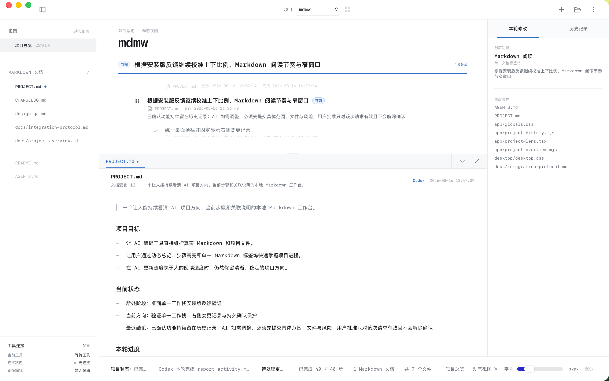

# Project Lens

**让人持续看清 AI 项目的方向、当前步骤与真实文档变化。**

Project Lens 是一个本地优先的 macOS 项目工作台。它读取你项目中的真实 Markdown 文件，把功能、阶段、任务、相关文档和 AI 工具活动整理成动态总览；不会把项目内容复制到云端。

> 免费使用 · 闭源软件 · 当前为 macOS 预览版



## 下载

请前往 [最新版本](https://github.com/lenuis/project-lens/releases/latest) 下载与你的 Mac 对应的安装包：

- Apple Silicon（M1 / M2 / M3 / M4）：`macOS-arm64.dmg`
- Intel Mac：`macOS-x64.dmg`
- `SHA256SUMS.txt`：用于核对下载文件是否完整

Project Lens 目前采用免费的 ad-hoc 签名方案，没有 Apple 公证。首次打开时 macOS 会显示安全提示，请在“系统设置 → 隐私与安全性”中确认“仍要打开”。以后可正常启动；无需关闭系统安全保护。

## 它解决什么问题

AI 编码速度很快，但项目方向、执行步骤和真实文档常常跟不上。Project Lens 把这些信息放在同一个本地界面里：

- **动态项目总览**：从 `PROJECT.md` 读取产品功能、项目阶段、任务与子步骤。
- **当前步骤定位**：点击总览任务，直接打开关联 Markdown 并定位到对应内容。
- **Markdown 工作区**：阅读、编辑、自动保存，支持多个 fenced 代码块和全文搜索。
- **工具活动与规则同步**：区分“工具正在连接”和“项目文档是否跟上代码变化”。
- **本轮修改与历史**：记录修改对应的功能、文件和用户确认状态；已确认功能不会被 AI 随意改动。
- **本地优先**：真实文件始终留在用户选择的项目文件夹中。

## 基本工作方式

```text
项目总览（软件实时生成，不是真实文件）
├─ PROJECT.md：项目方向、阶段与任务的事实入口
├─ 相关 Markdown：需求、设计、技术、测试、发布记录……
└─ 动态状态：修改时间、工具活动、规则同步与变更记录
```

Project Lens 不会创建一个需要人工维护的 `overview.html`。只有界面本身会根据真实文件实时生成总览。

## 开始使用

1. 下载并把 Project Lens 拖入“应用程序”。
2. 第一次启动时按上方说明允许 macOS 打开应用。
3. 在应用中选择一个真实项目文件夹。
4. 如果项目没有 `PROJECT.md`，Project Lens 会创建基础结构；已有内容不会被覆盖。
5. AI 工具通过项目中的 `AGENTS.md` 与 `PROJECT.md` 读取共同规则和当前方向。

## 隐私与安全

- 项目文件默认只在本机读取和写入。
- Project Lens 不要求上传项目正文，也不要求登录云端账号。
- 不要把 API Key、令牌或密码直接提交到 Git。需要密钥时，应使用 Project Lens 的项目授权流程与本地安全存储。
- 提交反馈时请勿附带私有源代码、项目密钥或其他敏感信息。

## 反馈与更新

- [提交使用问题或功能建议](https://github.com/lenuis/project-lens/issues/new?template=feedback.yml)
- [查看全部版本](https://github.com/lenuis/project-lens/releases)
- 应用内“检查更新”会打开 GitHub 最新版本页，不会静默安装。

## 许可说明

Project Lens 可以免费下载和使用，但源码不公开。软件及其发行文件保留所有权利，详见 [COPYRIGHT.md](COPYRIGHT.md)。

---

### English summary

Project Lens is a local-first macOS workspace that turns real Markdown project files into a live overview of product features, project phases, tasks, documentation, and AI-tool activity. It is free to use, distributed as closed-source software, and keeps project content in the folder selected by the user.
