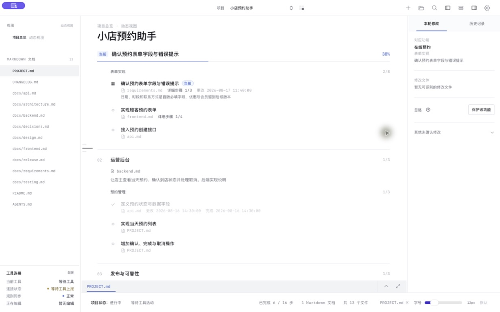
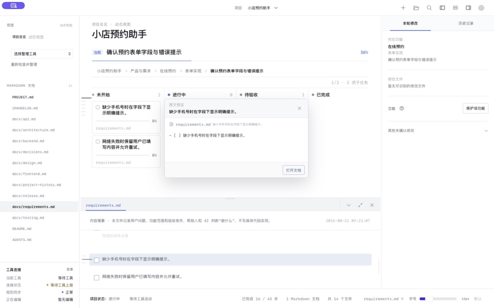

<p align="right">
  <strong>简体中文</strong> · <a href="./README.en.md">English</a>
</p>

# Project Lens

### 让人持续看清 AI 项目正在做什么、为什么这样做、下一步去哪里。

Project Lens 是一个本地优先的 macOS 项目工作台。它读取项目中真实的 Markdown 文件，把功能、阶段、任务、文档和 AI 工具活动整理成动态总览。即使不熟悉代码，也能知道项目当前做到哪里、最近改了什么，以及需要查看哪份说明。



## 五个核心能力

### 1. 从总览一步定位到真实内容

总览只展示产品功能、项目阶段和主任务，不把所有细节堆在同一个页面里。点击一个任务，Project Lens 会打开它关联的 Markdown，并定位到对应标题或待完成步骤。

```text
动态总览中的“确认预约表单字段与错误提示”
        ↓ 点击
打开 docs/requirements.md
        ↓
定位到“预约表单”及其验收条件
```



用户先看方向，需要细节时再进入真实文档；AI 也能沿着同一条链接找到应该维护的位置。

### 2. 看懂本轮修改与版本变化

Project Lens 把代码和文档变化归到对应功能，显示本轮修改、历史记录和用户确认状态。Git 继续保存真实提交，`CHANGELOG.md` 说明每个正式版本给用户带来了什么。

| 你看到的内容 | 它回答的问题 |
| --- | --- |
| 本轮修改 | AI 这一轮围绕哪个功能改了哪些文件？ |
| 历史记录 | 哪些功能已经确认，过去发生过什么变化？ |
| 版本记录 | 每个正式版本新增、修复或调整了什么？ |
| 功能保护 | 已确认的功能再次被修改前，风险是否经过用户批准？ |

### 3. 创建项目文档，让 AI 按同一套规则工作

设置中可以按需创建常用项目文档，而不是一次生成一堆空文件。每份文件都会说明自己的用途，供人和 AI 共同读取。

| 文档 | 用途 |
| --- | --- |
| `PROJECT.md` | 项目方向、阶段、任务和当前步骤的事实入口 |
| `CHANGELOG.md` | 正式版本的新增与修改 |
| `docs/decisions.md` | 重要产品或技术决策及选择原因 |
| `docs/testing.md` | 测试范围、验证结果和遗留风险 |
| `docs/frontend.md` / `backend.md` | 前后端结构、约束与实现清单 |
| `docs/api.md` / `data.md` | 接口、数据字段和迁移约定 |
| `docs/architecture.md` | 系统边界、依赖和关键技术路线 |

`AGENTS.md` 由 Project Lens 管理共享规则。Codex、Claude Code、Cursor、VS Code/Copilot、Windsurf、JetBrains、Zed 等工具可以读取同一个项目事实入口；工具专用文件只做薄入口，不复制任务状态。

### 4. 保护已经确认的功能与设计

当一个功能、交互或设计已经由用户确认，它会进入历史记录并成为受保护基线。以后 AI 若要改动，不能悄悄覆盖：必须先说明要改什么、会影响哪些文件，以及可能破坏哪些既有行为，再由用户批准这一次修改。

```text
确认功能或设计
        ↓
保存为受保护的历史基线
        ↓ AI 提议再次修改
展示范围、文件与风险
        ↓ 用户批准本次请求
只允许执行这一次明确变更
```

这不是把代码永久锁死，而是让必要的调整仍然可以发生，同时避免 AI 在后续对话中无意破坏已经验收的功能。一次批准不会解除保护；下一次再改仍需重新说明并确认。

### 5. 按用途批准项目密钥写入

`PROJECT_KEYS.md` 是用户本地维护的敏感文件，只供 Project Lens 读取，AI 工具不能读取其中的密钥值。AI 需要某个密钥时，只能提交不含密钥值的申请，写明密钥名称、用途、目标文件和环境变量字段。

用户批准后，Project Lens 会再次核对申请，并只把密钥写入这一次批准的精确位置。它会拒绝 Git 已跟踪文件、项目外路径、符号链接和不受支持的目标；密钥也不会进入对话、摘要、活动记录、代码注释或提交记录。用途、文件或字段变化时，必须重新申请。

这个流程适合本地开发配置，不替代系统钥匙串或部署平台的 Secret 管理。

## 完整示例项目

- [中文示例项目](examples/zh-CN)
- [English sample project](examples/en)

两份示例都包含项目事实、需求、设计、前端、后端、API、架构、测试、决策、发布和版本记录。每份文档开头都会说明用途，可以直接查看它们如何相互链接。

## 一个项目在 Project Lens 中是什么

```text
项目总览（软件实时生成，不是真实文件）
├─ PROJECT.md：项目方向、阶段与任务
├─ 需求 / 设计 / 技术 / 测试 / 发布等真实 Markdown
├─ 工具活动与规则同步状态
└─ 本轮修改、用户确认与版本历史
```

Project Lens 不生成需要人工维护的 `overview.html`。总览只是软件根据真实项目文件即时生成的阅读入口。

## 适合谁

- 使用 AI 编码，但不想在长对话里失去项目方向的人。
- 不熟悉所有代码，却需要判断功能是否真正完成的产品负责人或独立开发者。
- 同时使用多个 AI 工具，希望它们维护同一套项目规则和文档的人。
- 想保留真实 Markdown、Git 和本地文件，不希望项目状态被锁在某个云端工具里的人。

## 下载

前往 [最新版本](https://github.com/lenuis/project-lens/releases/latest) 下载与你的 Mac 对应的安装包：

- Apple Silicon（M1 / M2 / M3 / M4）：`macOS-arm64.dmg`
- Intel Mac：`macOS-x64.dmg`
- `SHA256SUMS.txt`：用于核对下载文件是否完整

Project Lens 目前采用免费的 ad-hoc 签名方案，没有 Apple 公证。首次打开时 macOS 会显示安全提示，请在“系统设置 → 隐私与安全性”中确认“仍要打开”。以后可正常启动；无需关闭系统安全保护。

## 开始使用

1. 下载并把 Project Lens 拖入“应用程序”。
2. 第一次启动时允许 macOS 打开应用。
3. 在应用中选择一个真实项目文件夹。
4. 如果项目没有 `PROJECT.md`，Project Lens 会创建基础结构；已有内容不会被覆盖。
5. 从动态总览查看方向，点击任务进入对应 Markdown。

## 本地与隐私

- 项目文件默认只在本机读取和写入。
- Project Lens 不要求上传项目正文，也不要求登录云端账号。
- 不要把 API Key、令牌或密码直接提交到 Git。需要密钥时，应使用项目授权流程与本地安全存储。
- 提交反馈时请勿附带私有源代码、项目密钥或其他敏感信息。

## 反馈与更新

- [提交使用问题或功能建议](https://github.com/lenuis/project-lens/issues/new?template=feedback.yml)
- [查看全部版本](https://github.com/lenuis/project-lens/releases)
- 应用内“检查更新”会打开 GitHub 最新版本页，不会静默安装。

## 许可说明

Project Lens 可以免费下载和使用，但源码不公开。软件及其发行文件保留所有权利，详见 [COPYRIGHT.md](COPYRIGHT.md)。
