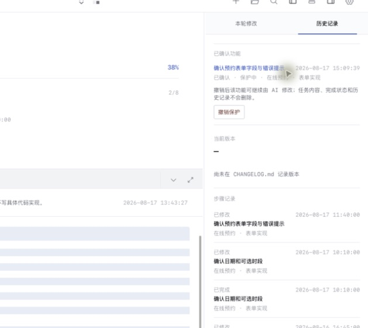
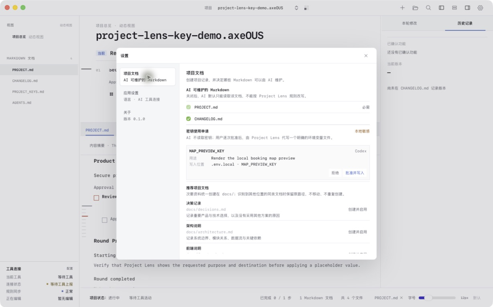

<p align="right">
  <a href="./README.md">产品介绍</a> · <strong>使用教程</strong> · <a href="./USAGE.en.md">English guide</a>
</p>

# Project Lens 使用教程

这是一份面向普通用户和 Vibe Coding 使用者的快速教程。你不需要先理解全部代码；Project Lens 会用项目中真实的 Markdown，把方向、当前步骤、关联说明和 AI 修改记录连接起来。

## 1. 第一次打开项目

1. 安装并打开 Project Lens。
2. 点击右上角的“打开文件夹”，选择真实项目根目录。
3. 如果项目还没有 `PROJECT.md`，Project Lens 会准备最小的项目结构和共享规则；已有内容不会被整份覆盖。
4. 项目会保留在选择列表中，下次打开应用可以继续使用。

总览是软件实时生成的工作界面，不是项目里的 `overview.html`：

- `PROJECT.md` 是功能、阶段、任务和子步骤的主要事实来源。
- 需求、设计、技术、测试等 Markdown 是可定位的详细说明。
- Git 变化、文件时间、工具连接和规则同步状态由软件动态计算。
- 只有执行导出时才会产生静态文件；日常使用不需要维护一份 HTML 总览。


## 2. 看懂主界面

- **动态总览**：先看项目方向、整体进度、当前功能、阶段、任务和子步骤。
- **左侧文档列表**：项目中真实存在的 Markdown 文件。点击后会在下方文档区打开。
- **下方 Markdown 文档区**：阅读或编辑当前文档；从总览点击任务时，会自动定位并高亮对应内容。
- **右侧本轮修改 / 历史记录**：查看某个功能本轮改了哪些文件，并确认或保护已经验收的功能。
- **左下角工具连接**：区分工具是否正在读写项目，以及代码与项目文档是否仍保持同步。

## 3. 用 `PROJECT.md` 表达项目方向

总览层级只需要维护在根目录的 `PROJECT.md`：

```md
## 产品功能

### 用户登录

#### 邮箱登录

- [~] 完成邮箱登录 [[docs/requirements.md#邮箱登录|需求说明]]
  - [ ] 实现登录表单
  - [ ] 验证错误提示
```

对应关系：

- `###`：产品功能。
- `####`：项目阶段。
- 顶格复选项：任务。
- 缩进复选项：子步骤。
- `[ ]`：未开始；`[~]`：当前进行；`[x]`：已完成。
- 整个项目只保留一个 `[~]` 当前步骤。
- `[[相对路径#标题|显示名称]]`：把任务连接到真实 Markdown 的具体标题。

点击总览任务后，Project Lens 会打开关联文档并定位到对应内容，而不是把整份详情重复塞进总览。


## 4. 创建有用途的项目文档

打开“设置 → 项目文档”。“创建并启用”表示：仅在文件不存在时创建带用途说明的模板，同时允许 AI 在项目规则范围内维护它。Project Lens 不会一次性创建全部文档，也不会移动或删除你已有的同类文件。

| 文档 | 用途 | 什么时候需要 |
| --- | --- | --- |
| `PROJECT.md` | 当前方向、阶段、任务和子步骤 | 必需，不能关闭 |
| `AGENTS.md` | Project Lens 与 AI 工具共享规则 | 由 Project Lens 管理 |
| `CHANGELOG.md` | 每个正式版本面向用户的新增和修改 | 默认推荐 |
| `docs/decisions.md` | 重要产品或技术选择及原因 | 出现长期影响的决策时 |
| `docs/architecture.md` | 系统边界、模块关系和关键约束 | 中大型项目 |
| `docs/frontend.md` | 前端结构、状态、组件和 UI 约定 | 前端项目 |
| `docs/backend.md` | 服务、任务、权限和错误处理 | 后端项目 |
| `docs/api.md` | 接口、请求、响应和兼容约束 | 有接口时 |
| `docs/data.md` | 数据模型、字段、映射 key 与生命周期 | 有持久数据时 |
| `docs/testing.md` | 测试范围、验证结果和遗留风险 | 发布前推荐 |
| `docs/migrations.md` | 数据库、接口或配置迁移步骤 | 存在迁移时 |
| `SECURITY.md` | 安全策略与漏洞处理方式 | 公开产品推荐 |
| `CONTRIBUTING.md` | 团队或开源协作规则 | 多人项目 |
| `.github/PULL_REQUEST_TEMPLATE.md` | GitHub PR 范围、验证与风险模板 | GitHub 协作项目 |
| `.github/ISSUE_TEMPLATE/*.md` | 问题与需求提交模板 | GitHub 协作项目 |
| `PROJECT_KEYS.md` | 只保存当前项目所需密钥的本地值 | 需要按用途授权密钥时 |

不要创建 `GIT_LOG.md`：真实提交历史由 Git 保存；`CHANGELOG.md` 只记录正式版本对用户产生了什么变化。

你也可以参考仓库中的 [中文完整示例项目](./examples/zh-CN/README.md)。

## 5. 决定哪些文档允许 AI 维护

- `PROJECT.md` 是项目方向的必需事实入口，不能停用。
- `AGENTS.md` 由 Project Lens 维护，不作为普通文档开关。
- 其他 Markdown 可以在“设置 → 项目文档”中启用或停用。
- 停用表示 AI 不应修改该文件；用户仍然可以阅读和手动编辑。
- 已存在于其他合理目录的同类文档会被保留，不会为了统一路径被移动或删除。

## 6. 让 AI 工具持续遵守规则

Project Lens 会为不同 AI 工具准备轻量入口，但共享事实仍只有两处：

- `PROJECT.md`：项目方向和当前工作。
- `AGENTS.md`：Project Lens 工作规则。

工具开始工作、准备完成任务时，应重新读取它们。Project Lens 还会比较代码变化和文档同步情况：

- **连接中**：检测到工具正在读写项目。
- **规则同步正常**：代码与当前步骤、相关 Markdown 保持一致。
- **需要同步**：代码持续变化，但项目步骤或说明长时间没有更新。

支持 Hook 的工具可以收到更及时的提醒；其他编辑器和 AI 工具仍可通过文件变化检测获得警告。

## 7. 确认并保护已经验收的功能

当一个功能已经符合预期，可以在右侧“本轮修改”中确认并保护它。保护不是完全锁死：以后 AI 如果确实需要修改，必须先说明修改范围、文件和风险，再由用户对这一次请求批准。

已确认记录会进入该项目自己的“历史记录”，不会与其他项目混合。



## 8. 按用途批准项目密钥

不要把真实密钥写进普通说明、对话或 Git。推荐流程：

1. 在“设置 → 项目文档”中创建 `PROJECT_KEYS.md`。
2. 用户在本地填写密钥值，AI 默认不能读取这个文件。
3. AI 只提交密钥名称、用途、目标文件和目标字段，不提交密钥值。
4. 用户在 Project Lens 中检查请求并批准。
5. Project Lens 只把该值写到当前项目的精确目标位置。

目标必须位于当前项目内，并且不能是 Git 正在跟踪的文件、符号链接或项目外路径。



## 9. 编辑、搜索和定位 Markdown

- Markdown 可以直接在 Project Lens 中编辑并自动保存；保存成功后会出现短暂提示。
- 搜索按钮或 `Command/Ctrl + F` 可以搜索项目 Markdown 全文。
- 点击搜索结果会打开对应文件并定位到命中位置。
- 右键文档可选择适合打开 Markdown 的本地应用，也可以删除允许删除的文档。
- 从任务、变更记录或搜索结果进入文档时，高亮只是软件界面状态，不会写进 Markdown。

## 10. 推荐的日常流程

1. 打开项目，先看当前步骤和整体方向。
2. 点击任务，阅读对应的需求、设计或技术说明。
3. 让 AI 按 `PROJECT.md` 和 `AGENTS.md` 工作。
4. 在右侧查看本轮修改对应的功能和文件。
5. 验证结果；满意后确认并保护功能，不满意则继续修改或忽略记录。
6. 发布正式版本时更新 `CHANGELOG.md`，真实提交继续交给 Git 保存。

## 11. 更新应用与移除项目

- 在“设置 → 关于”中检查更新。下载新版本后替换应用即可，项目文件和记录不会随应用替换而删除。
- 在项目选择器中悬停已有项目，可以将它从列表移除。
- 移除时可以只清除列表，也可以一并清理 Project Lens 为该项目保存的运行记录；真实项目文件不会被删除。

## 需要帮助？

- [下载最新版本](https://github.com/lenuis/project-lens/releases/latest)
- [提交问题或建议](https://github.com/lenuis/project-lens/issues)
- [查看中文完整示例](./examples/zh-CN/README.md)
- [Read this guide in English](./USAGE.en.md)
